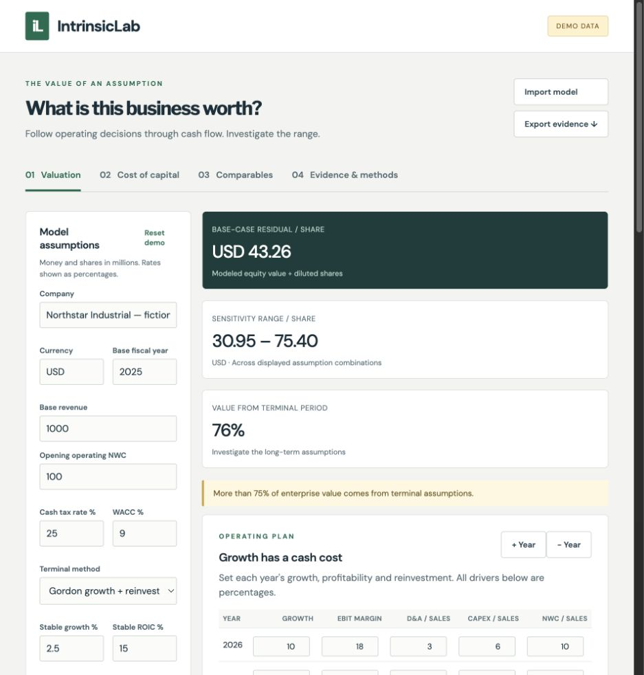

# IntrinsicLab

**Trace how growth, margins, reinvestment and the cost of capital change the value of a business.**



## The financial question
What must be true about a company's economics for a valuation to make sense? A share-price estimate alone conceals that question. IntrinsicLab follows the assumptions through annual cash flows, financing costs and a transparent enterprise-to-equity bridge, then shows how readily the answer changes.

## Why I built this
Revenue growth can create value or consume it. A company that must invest heavily to grow may generate much less cash than its income statement suggests. I wanted to make the connections between profitability, reinvestment, return on capital and valuation inspectable in a working product.

## Financial framework
FCFF = EBIT − cash taxes + D&A − CapEx − change in operating working capital.

These cash flows belong to all capital providers, so they are discounted at WACC. CAPM estimates the cost of equity; market-value financing weights blend equity and after-tax debt costs. Terminal value can use a Gordon-growth perpetuity or an EV/EBITDA exit multiple.

In the Gordon model, stable reinvestment is NOPAT × growth / ROIC. Growth is not free. Enterprise value is reconciled to equity after debt, preferred capital, noncontrolling interests and nonoperating cash. Money and shares are both in millions, so their ratio is ordinary currency per share.

## What the system analyzes
- Editable annual growth, operating margins, D&A, CapEx and working-capital drivers.
- CAPM and market-value WACC with an explicit tax-shield assumption.
- DCF using stable reinvestment or final-year EBITDA exit multiples.
- WACC × terminal-growth / exit-multiple sensitivity with invalid cells explained.
- P/E, EV/EBITDA, EV/sales and P/book for imported peers; undefined multiples remain unavailable.
- JSON model import, annual CSV normalization, provenance, scenario comparison and reproducible evidence export.

The browser derives every result from the Python engine. There is no invented quote feed or AI-generated financial number. The included fictional company is visibly labeled **DEMO DATA**. Imported source information is user-asserted and retained, not certified as audited.

## Example financial interpretation
The included Northstar Industrial teaching model calculates **USD43.26 per share** at 9% WACC and 2.5% terminal growth. About **76% of enterprise value comes from the terminal period**. Across the displayed WACC/growth combinations the range is **USD30.95–75.40**. These are observed outputs of the versioned fictional assumptions, not market data or a confidence interval.

The interesting result is the dependence on long-term economics: a plausible-looking central number can coexist with substantial assumption risk. Recalculate the model at a higher WACC, or lower terminal ROIC, and investigate where the value disappears.

## Running the project
Python3.12+ and Node22+ for browser checks. No API key, database or Docker daemon is needed.

```bash
python3 -m venv .venv
.venv/bin/python -m pip install -r requirements.lock
.venv/bin/python -m pip install --no-deps -e .
.venv/bin/python -m uvicorn intrinsiclab.api:app --host 127.0.0.1 --port 8016
```

Open [the workbench](http://127.0.0.1:8016) or [OpenAPI docs](http://127.0.0.1:8016/docs). Use **Import model** for a JSON assumption document or an exported evidence file. Evidence import always recalculates the assumptions. **Evidence & methods** accepts annual CSV. The comparables screen downloads an exact input example.

## Architecture
Typed inputs → annual normalization → pure financial functions → analysis service → FastAPI → browser workbench.

See [architecture](docs/ARCHITECTURE.md) for boundaries and [data dictionary](docs/DATA_DICTIONARY.md) for units. Browser case snapshots stay in local browser storage. The API is stateless and intended for personal local research.

## Tests and reproducibility
```bash
npm ci
npx playwright install chromium
scripts/verify.sh
.venv/bin/python scripts/check_secrets.py
```

Validation covers hand-calculated FCFF/DCF identities, reinvestment, loss taxes, negative equity, denominator failures, chronological annual imports, API errors and request limits. Browser tests exercise changing WACC, clearing invalid results, saving/restoring cases and mobile layout. CI runs tests, lint, Python type checking, browser checks, package build and a tracked-file secret-pattern scan. Python transitive versions and Node dependencies are locked.

## Assumptions and limitations
Annual nominal forecasts use end-of-year discounting, one currency and constant tax assumptions. No loss carryforward is modeled. WACC assumes usable tax shields; the analyst must supply appropriate market financing values. Terminal margins and ROIC require a credible transition from the explicit period. Banks, distress and real options need richer models. No live issuer information or personalized recommendation is supplied.

Read [methodology](docs/METHODOLOGY.md) and [limitations](docs/LIMITATIONS.md) before interpreting results. A sensitivity interval is a set of conditional scenarios, not a probability statement.

## Future research
How should operating margins and incremental ROIC converge together? When does an exit multiple imply an implausible reinvestment policy? How much do stub periods, leases, stock compensation and tax-loss utilization change the equity bridge?

MIT licensed. Contributions should preserve the distinction between evidence, assumptions and calculated interpretation.
