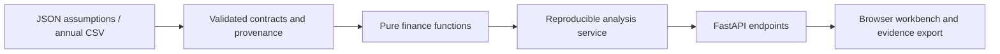

# Architecture

`contracts.py` defines finite, bounded annual inputs. `ingest.py` rejects inconsistent fiscal/currency data. `capital.py`, `forecast.py`, `dcf.py` and `comparables.py` own financial calculations; the browser never duplicates them. `sensitivity.py` recomputes every scenario. `service.py` hashes canonical assumptions and derives explanations from outputs. `api.py` validates HTTP boundaries. `http_limits.py` bounds request memory including chunked uploads. Browser assets ship in the installable wheel.

The API is stateless and deliberately local. Bind to 127.0.0.1. Public multi-user deployment needs authentication, rate limits and deployment-specific security. There are no provider credentials and no LLM in the numerical path. Unavailable input and invalid economics return HTTP422; oversized requests return413. Logging does not dump user financial files.

Browser cases are local convenience snapshots, never authoritative financial records. Importing an exported evidence document recalculates the assumptions with the installed engine rather than trusting stored numbers. No chart displays new results while recalculation is pending. Tables expose all visualized data.
